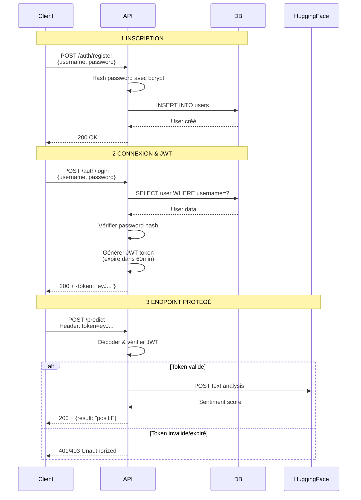

# TasentimentXP - Backend API

[](https://fastapi.tiangolo.com/)
[](https://www.python.org/)
[](https://www.postgresql.org/)
[](https://www.docker.com/)
[](https://github.com/votre-username/sentiment-analysis-backend/actions)


## Description

Backend de l'application **TasentimentXP** : une API RESTful sécurisée qui utilise l'intelligence artificielle pour analyser le sentiment de textes (positif, neutre, négatif).

L'API intègre le modèle BERT multilingue de HuggingFace et implémente une authentification JWT robuste.

---

## Fonctionnalités

### Analyse de Sentiment IA

- **Modèle** : `nlptown/bert-base-multilingual-uncased-sentiment`
- **Sortie** : Type String `positif`/`negatif`/`neutral` (Score de 1 à 5 étoiles)
- **Interprétation** :
  - 1-2 ⭐ = **Négatif** 😞
  - 3 ⭐ = **Neutre** 😐
  - 4-5 ⭐ = **Positif** 😊
- **Multilingue** : Supporte français, anglais, espagnol, allemand, italien, néerlandais

### Authentification JWT

- **Inscription** (`POST /auth/register`) : Création de nouveaux utilisateurs
- **Connexion** (`POST /auth/login`) : Génération de token JWT
- **Protection** : Endpoints protégés via `Depends(verify_token)`
- **Sécurité** : Hashage des mots de passe avec bcrypt

### Base de Données PostgreSQL


- **Tables** : `users` (id, username, password, created_at)
- **Connexion** : Gestion efficace du pool de connexions

### Dockerisation

- **Multi-stage build** : Image optimisée
- **Docker Compose** : Backend + PostgreSQL en une seule commande

### Tests Automatisés

- **Framework** : Pytest + pytest-asyncio + pytest-mock
- **Coverage** : **87%** de couverture de code
- **CI/CD** : GitHub Actions pour tests automatiques sur chaque push
- **Tests** :
  - ✅ Authentification (inscription, connexion, JWT valide/invalide)
  - ✅ Analyse de sentiment avec/sans token
  - ✅ Endpoints protégés
  - ✅ Gestion d'erreurs (API HuggingFace indisponible)

---

## Technologies Utilisées

| Technologie | Version | Rôle |
|------------|---------|------|
| **FastAPI** | 0.104+ | Framework web asynchrone |
| **Python** | 3.11 | Langage de programmation |
| **PostgreSQL** | 15 | Base de données relationnelle |
| **Psycopg2** | 2.9+ | Driver PostgreSQL |
| **PyJWT** | 2.8+ | Gestion des tokens JWT |
| **Passlib** | 1.7+ | Hashage des mots de passe (bcrypt) |
| **Requests** | 2.31+ | Requêtes HTTP vers HuggingFace |
| **Uvicorn** | 0.24+ | Serveur ASGI |
| **Pytest** | 7.4+ | Framework de tests |
| **Pytest-mock** | 3.12+ | Mocking pour les tests |
| **Docker** | 24+ | Conteneurisation |

---

## Architecture du Projet
```
SENTIMENT-ANALYSIS-BACKEND/
├── app/
│   ├── auth/
│   │   └── token_auth.py          # Gestion JWT (création, vérification)
│   │
│   ├── core/
│   │   └── config.py              # Configuration (env vars, settings)
│   │
│   ├── database/
│   │   └── db_connection.py       # Pool de connexions PostgreSQL
│   │
│   ├── routes/
│   │   ├── login_router.py        # POST /auth/login
│   │   ├── register_router.py     # POST /auth/register
│   │   ├── sentiment_router.py    # POST /predict (protégé JWT)
│   │   └── getdata_router.py      # GET /data (exemple endpoint)
│   │
│   ├── schemas/
│   │   ├── LoginRequest.py        # Schéma Pydantic pour login
│   │   ├── SentimentRequest.py    # Schéma pour requête sentiment
│   │   └── user_schema.py         # Schéma utilisateur
│   │
│   ├── services/
│   │   └── huggingface_service.py # Appel API HuggingFace Inference
│   │
│   ├── __init__.py
│   └── main.py                    # Point d'entrée FastAPI
│
├── tests/
│   ├── __init__.py
│   ├── test_auth.py               # Tests authentification
│   └── test_sentiment.py          # Tests analyse sentiment
│
├── .github/
│   └── workflows/
│       └── main.yml               # CI/CD GitHub Actions
│
├── .env.example                   # Template des env vars
├── .gitignore
├── docker-compose.yml             # Orchestration Docker
├── Dockerfile                     # Image Docker du backend
├── init.sql                       # Script d'initialisation PostgreSQL
├── requirements.txt               # Dépendances Python
└── README.md                      # Ce fichier !
```

---

## Installation et Lancement

### Prérequis

- **Python** 3.11+
- **PostgreSQL** 15+ (ou utiliser Docker)
- **Docker** (optionnel, recommandé)

---

### Option 1 : Installation Locale

#### 1. Cloner le repository
```bash
git clone https://github.com/votre-username/sentiment-analysis-backend.git
cd sentiment-analysis-backend
```

#### 2. Créer un environnement virtuel
```bash
python -m venv .venv

# Activer l'environnement
# Windows
.venv\Scripts\activate
# Mac/Linux
source .venv/bin/activate
```

#### 3. Installer les dépendances
```bash
pip install -r requirements.txt
```

#### 4. Configurer PostgreSQL

Créez une base de données :
```bash
psql -U postgres
CREATE DATABASE sentiment_db;
CREATE USER sentiment_user WITH PASSWORD 'votre_password';
GRANT ALL PRIVILEGES ON DATABASE sentiment_db TO sentiment_user;
GRANT USAGE, SELECT ON SEQUENCE users_id_seq TO sentiment_user;
\q
```

Initialisez les tables :
```bash
psql -U sentiment_user -d sentiment_db -f init.sql
```

#### 5. Configurer les variables d'environnement

Copiez `.env.example` vers `.env` et modifiez :
```env
# JWT
SK=votre_secret_key_super_longue_et_aleatoire
ALG=HS256
ACCESS_TOKEN_EXPIRE_MINUTES=60

# HuggingFace
HF_API_TOKEN=hf_VotreTokenIci

# PostgreSQL
DB_HOST=localhost
DB_PORT=5432
DB_NAME=sentiment_db
DB_USER=sentiment_user
DB_PASSWORD=votre_password
```

#### 6. Lancer le serveur
```bash
uvicorn app.main:app --reload --host 0.0.0.0 --port 8000
```

- **API accessible sur** : [http://localhost:8000](http://localhost:8000)
- **Documentation auto** : [http://localhost:8000/docs](http://localhost:8000/docs)

---

### Option 2 : Docker (Recommandé)

#### 1. Cloner le repository
```bash
git clone https://github.com/votre-username/sentiment-analysis-backend.git
cd sentiment-analysis-backend
```

#### 2. Créer le fichier .env
```bash
cp .env.example .env
# Éditer .env avec vos valeurs
```

#### 3. Lancer avec Docker Compose
```bash
docker-compose up --build
```

Cela lance automatiquement :
- **PostgreSQL** sur le port `5432`
- **FastAPI** sur le port `8000`

**API accessible sur** : [http://localhost:8000](http://localhost:8000)

#### 4. Arrêter les conteneurs
```bash
docker-compose down
```

---

## Endpoints API

### Endpoints Publics

#### POST `/auth/register`

Créer un nouveau compte utilisateur.

**Request Body :**
```json
{
  "username": "manal",
  "password": "SecurePassword123!"
}
```

**Response :**
```json
{
  "message": "Utilisateur créé avec succès"
}
```

---

#### POST `/auth/login`

Connexion et obtention d'un JWT token.

**Request Body :**
```json
{
  "username": "manal",
  "password": "SecurePassword123!"
}
```

**Response :**
```json
{
  "token": "eyJhbGciOiJIUzI1NiIsInR5cCI6IkpXVCJ9..."
}
```

---

### Endpoints Protégés (JWT requis)

#### POST `/predict`

Analyser le sentiment d'un texte.

**Headers :**
```
Authorization: Bearer <votre_jwt_token>
```

**Request Body :**
```json
{
  "text": "J'adore ce produit, il est incroyable !"
}
```

**Response :**
```json
{
  "sentiment": "positif (4 a 5 etoiles)"
}
```

**Codes d'erreur :**
- `401` : Token manquant ou invalide
- `403` : Token expiré
- `422` : Validation error
- `500` : Erreur API HuggingFace ou serveur

---

## Authentification JWT - Workflow Détaillé

### Fonctionnement du Système JWT

Le système d'authentification suit un workflow en 3 étapes principales :


---

### Détails Techniques

#### 1. Inscription (`/auth/register`)
```python
# Le mot de passe est hashé avec bcrypt
hashed_password = bcrypt.hashpw(password.encode('utf-8'), bcrypt.gensalt())

# Stockage sécurisé dans PostgreSQL
INSERT INTO users (username, password) VALUES (?, ?)
```

#### 2. Connexion (`/auth/login`)
```python
# Vérification du password
if bcrypt.checkpw(password.encode('utf-8'), stored_hash):
    # Génération du JWT
    payload = {
        "sub": username,
        "exp": datetime.utcnow() + timedelta(minutes=60)
    }
    token = jwt.encode(payload, SECRET_KEY, algorithm="HS256")
    return {"token": token}
```

#### 3. Protection des Endpoints
```python
# Dépendance FastAPI pour vérifier le token
async def verify_token(token: str = Header(...)):
    try:
        payload = jwt.decode(token, SECRET_KEY, algorithms=["HS256"])
        username = payload.get("sub")
        return username
    except jwt.ExpiredSignatureError:
        raise HTTPException(status_code=403, detail="Token expired")
    except jwt.InvalidTokenError:
        raise HTTPException(status_code=401, detail="Invalid token")
```

---

### Exemple d'Utilisation Complet
```bash
# 1. Créer un compte
curl -X POST http://localhost:8000/auth/register \
  -H "Content-Type: application/json" \
  -d '{"username": "alice", "password": "secure123"}'

# 2. Se connecter et récupérer le token
TOKEN=$(curl -X POST http://localhost:8000/auth/login \
  -H "Content-Type: application/json" \
  -d '{"username": "alice", "password": "secure123"}' \
  | jq -r '.token')

# 3. Utiliser le token pour analyser un texte
curl -X POST http://localhost:8000/predict \
  -H "Content-Type: application/json" \
  -H "Authorization: Bearer $TOKEN" \
  -d '{"text": "Ce film est absolument génial !"}'
```

---

## Tests

### Structure des Tests

Les tests garantissent la fiabilité de l'API avec une couverture de **87%** du code.

#### Résultats des Tests GitHub Actions
```
============================= test session starts ==============================
platform linux -- Python 3.11.14, pytest-9.0.1, pluggy-1.6.0
collecting ... collected 5 items

tests/test_auth.py::test_register_new_user PASSED                        [ 20%]
tests/test_auth.py::test_login_success PASSED                            [ 40%]
tests/test_sentiment.py::test_predict_sentiment_without_token PASSED     [ 60%]
tests/test_sentiment.py::test_predict_sentiment_with_valid_token PASSED  [ 80%]
tests/test_sentiment.py::test_get_data_with_valid_token PASSED           [100%]

================================ tests coverage ================================
Name                                  Stmts   Miss  Cover
---------------------------------------------------------
app/__init__.py                           0      0   100%
app/auth/token_auth.py                    9      2    78%
app/core/config.py                       13      0   100%
app/database/db_connection.py             6      0   100%
app/main.py                              15      1    93%
app/routes/getdata_router.py             11      2    82%
app/routes/login_router.py               29      6    79%
app/routes/register_router.py            27      6    78%
app/routes/sentiment_router.py           10      0   100%
app/schemas/LoginRequest.py               4      0   100%
app/schemas/SentimentRequest.py           3      0   100%
app/schemas/user_schema.py                4      0   100%
app/services/huggingface_service.py      19      3    84%
---------------------------------------------------------
TOTAL                                   150     20    87%

============================== 5 passed in 2.74s ===============================
```
---

### Lancer les Tests
```bash
# Tous les tests
python3 pytest

# Verbose avec détails
python3 pytest -v
```
---

## CI/CD avec GitHub Actions

À chaque push ou Pull Request, les tests s'exécutent automatiquement avec une couverture de code complète.

---

## Limites et Considérations du Service IA

### Limites de l'API HuggingFace Inference

L'analyse de sentiment repose sur l'API HuggingFace Inference, qui présente certaines limitations :


#### 1. **Précision du Modèle**

- **Performance** : ~85-90% de précision sur les langues supportées
- **Meilleur sur** : Avis produits, tweets, commentaires courts
- **Moins précis sur** : Textes ironiques, sarcasme, langage très technique


---

## Déploiement sur Render

### Déploiement Automatique

1. **Connecter GitHub** : Liez votre repo à Render
2. **Créer un Web Service** :
   - **Build Command** : `pip install -r requirements.txt`
   - **Start Command** : `fastapi run dev app.main.py`

3. **Créer une PostgreSQL Database** sur Render
4. **Configurer les variables d'environnement** :
```env
SK=<secret_key>
HF_API_TOKEN=<token_huggingface>
DB_HOST=<render_postgres_host>
DB_PORT=5432
DB_NAME=sentiment_db_gsda
DB_USER=sentiment_user
DB_PASSWORD=<render_postgres_password>
```

5. **Initialiser la DB** :
```bash
# Via Render Shell
psql -h <host> -U sentiment_user -d sentiment_db_gsda
CREATE TABLE IF NOT EXISTS users (
    id SERIAL PRIMARY KEY,
    username VARCHAR(100) UNIQUE NOT NULL,
    password VARCHAR(255) NOT NULL,
    created_at TIMESTAMP DEFAULT CURRENT_TIMESTAMP
);
```

**URL de production** : [https://tasentimentxp-backend-nnql.onrender.com](https://tasentimentxp-backend-nnql.onrender.com)

---

## Dépannage

### Erreur : relation "users" does not exist

**Cause** : La table `users` n'a pas été créée dans PostgreSQL.

**Solution** :
```bash
psql -U sentiment_user -d sentiment_db -f init.sql
```

---

### Erreur : CORS policy

**Cause** : Frontend bloqué par CORS.

**Solution** : Vérifier que l'origine frontend est autorisée dans `main.py` :
```python
from fastapi.middleware.cors import CORSMiddleware

# Configuration CORS
app.add_middleware(
    CORSMiddleware,
    allow_origins=["*"],  # URL du frontend
    allow_credentials=True,
    allow_methods=["*"],  # Autorise toutes les méthodes (GET, POST, etc.)
    allow_headers=["*"],  # Autorise tous les headers
)
```

---

### Erreur : HuggingFace API 503

**Cause** : Le modèle HuggingFace est en cours de chargement (cold start).

**Solution** : Réessayer après quelques secondes. Implémenter un retry logic :
```python
import time
import requests

def call_huggingface_with_retry(text, max_retries=3):
    for attempt in range(max_retries):
        response = requests.post(...)
        if response.status_code == 200:
            return response.json()
        time.sleep(2 ** attempt)  # Backoff exponentiel
    raise Exception("API HuggingFace indisponible")
```

---

### Erreur : JWT Token Invalid

**Cause** : Token expiré ou malformé.

**Solution** :
```python
# Vérifier la durée de validité du token
ACCESS_TOKEN_EXPIRE_MINUTES=60  # dans .env

# Côté client, gérer l'expiration
if (response.status_code == 403):
    # Rediriger vers login
    window.location.href = '/login'
```

---

### Erreur : Database Connection Failed

**Cause** : PostgreSQL n'est pas accessible.

**Solution** :
```bash
# Vérifier que PostgreSQL est démarré
sudo systemctl status postgresql

# Vérifier les credentials dans .env
DB_HOST=localhost
DB_PORT=5432
DB_NAME=sentiment_db
DB_USER=sentiment_user
DB_PASSWORD=correct_password

# Tester la connexion
psql -h localhost -U sentiment_user -d sentiment_db
```

---

## Métriques de Performance

### Coverage de Code

| Module | Statements | Miss | Cover |
|--------|-----------|------|-------|
| `app/__init__.py` | 0 | 0 | **100%** |
| `app/auth/token_auth.py` | 9 | 2 | **78%** |
| `app/core/config.py` | 13 | 0 | **100%** |
| `app/database/db_connection.py` | 6 | 0 | **100%** |
| `app/main.py` | 15 | 1 | **93%** |
| `app/routes/getdata_router.py` | 11 | 2 | **82%** |
| `app/routes/login_router.py` | 29 | 6 | **79%** |
| `app/routes/register_router.py` | 27 | 6 | **78%** |
| `app/routes/sentiment_router.py` | 10 | 0 | **100%** |
| `app/schemas/LoginRequest.py` | 4 | 0 | **100%** |
| `app/schemas/SentimentRequest.py` | 3 | 0 | **100%** |
| `app/schemas/user_schema.py` | 4 | 0 | **100%** |
| `app/services/huggingface_service.py` | 19 | 3 | **84%** |
| **TOTAL** | **150** | **20** | **87%** |

---

### Tests Passés

✅ **5/5 tests passés** en 2.74 secondes

- `test_auth.py::test_register_new_user` - ✅ PASSED
- `test_auth.py::test_login_success` - ✅ PASSED
- `test_sentiment.py::test_predict_sentiment_without_token` - ✅ PASSED
- `test_sentiment.py::test_predict_sentiment_with_valid_token` - ✅ PASSED
- `test_sentiment.py::test_get_data_with_valid_token` - ✅ PASSED

---

## Remerciements

- **HuggingFace** : Pour l'API Inference et le modèle BERT 
- **FastAPI** : Framework moderne et performant
- **Render** : Hébergement gratuit et simple
- **PostgreSQL** : Base de données robuste et open-source
- **GitHub Actions** : CI/CD automatisé et gratuit

---

## 🔗 Liens Utiles

- **Frontend Repository** : [GitHub](https://github.com/manalfarouq/Sentiment-analysis-frontend)
- **Frontend Live** : [https://sentiment-analysis-frontend-vert.vercel.app/](https://sentiment-analysis-frontend-vert.vercel.app/)
- **Backend API** : [https://tasentimentxp-backend-nnql.onrender.com](https://tasentimentxp-backend-nnql.onrender.com)
- **Documentation Interactive** : [https://tasentimentxp-backend-nnql.onrender.com/docs](https://tasentimentxp-backend-nnql.onrender.com/docs)
- **HuggingFace Model** : [nlptown/bert-base-multilingual-uncased-sentiment](https://huggingface.co/nlptown/bert-base-multilingual-uncased-sentiment)

---

## Roadmap

### Version Actuelle (v1.0)

- ✅ Authentification JWT complète
- ✅ Analyse de sentiment multilingue
- ✅ Tests automatisés avec 87% de couverture
- ✅ CI/CD avec GitHub Actions
- ✅ Déploiement sur Render

---

## Documentation Supplémentaire

### API Documentation

La documentation interactive complète de l'API est disponible à :
- **Swagger UI** : [https://tasentimentxp-backend-nnql.onrender.com/docs](https://tasentimentxp-backend-nnql.onrender.com/docs)
- **ReDoc** : [https://tasentimentxp-backend-nnql.onrender.com/redoc](https://tasentimentxp-backend-nnql.onrender.com/redoc)

### Ressources Utiles

- [FastAPI Documentation](https://fastapi.tiangolo.com/)
- [PostgreSQL Documentation](https://www.postgresql.org/docs/)
- [JWT Best Practices](https://auth0.com/blog/a-look-at-the-latest-draft-for-jwt-bcp/)
- [HuggingFace Inference API](https://huggingface.co/docs/api-inference/index)
- [Docker Best Practices](https://docs.docker.com/develop/dev-best-practices/)
