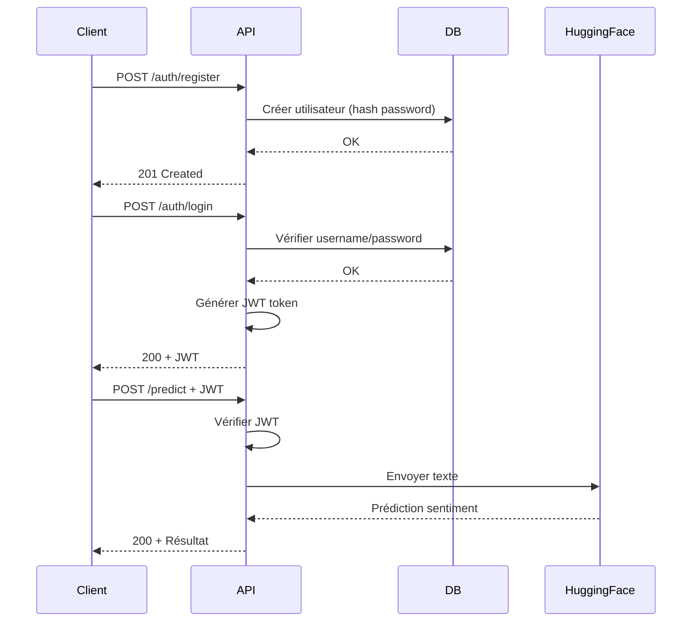

# TasentimentXP - Backend API 

[](https://fastapi.tiangolo.com/)
[](https://www.python.org/)
[](https://www.postgresql.org/)
[](https://www.docker.com/)

## Description

Backend de l'application **TasentimentXP** : une API RESTful sécurisée qui utilise l'intelligence artificielle pour analyser le sentiment de textes (positif, neutre, négatif).

L'API intègre le modèle BERT multilingue de HuggingFace et implémente une authentification JWT robuste.

---

## Fonctionnalités

### Analyse de Sentiment IA

- **Modèle** : `nlptown/bert-base-multilingual-uncased-sentiment`
- **Sortie** : De type String `positif`/`negatif`/`neutral` (Score de 1 à 5 étoiles)
- **Interprétation** :
  - 1-2 ⭐ = **Négatif** 😞
  - 3 ⭐ = **Neutre** 😐
  - 4-5 ⭐ = **Positif** 😊
- **Multilingue** : Supporte français, anglais, espagnol, allemand, italien, néerlandais

### Authentification JWT

- **Inscription** (`POST /auth/register`) : Création de nouveaux utilisateurs
- **Connexion** (`POST /auth/login`) : Génération de token JWT
- **Protection** : Endpoints protégés via `Depends(verify_token)`
- **Sécurité** : Hashage des mots de passe avec bcrypt

### Base de Données PostgreSQL

- **Tables** : `users` (id, username, password, created_at)
- **Connexion** : Gestion efficace des connexions

### Dockerisation

- **Multi-stage build** : Image optimisée
- **Docker Compose** : Backend + PostgreSQL en une seule commande

### Tests Automatisés

- **Framework** : Pytest + pytest-asyncio
- **Coverage** : Rapport de couverture avec Codecov
- **CI/CD** : GitHub Actions pour tests automatiques sur chaque push
- **Tests** :
  - Authentification (login, register, JWT invalide)
  - Analyse de sentiment (texte positif, neutre, négatif)
  - Gestion d'erreurs (API HuggingFace down, etc.)

---

## Technologies Utilisées

| Technologie | Version | Rôle |
|------------|---------|------|
| **FastAPI** | 0.104+ | Framework web asynchrone |
| **Python** | 3.11 | Langage de programmation |
| **PostgreSQL** | 15 | Base de données relationnelle |
| **Psycopg2** | 2.9+ | Driver PostgreSQL |
| **PyJWT** | 2.8+ | Gestion des tokens JWT |
| **Passlib** | 1.7+ | Hashage des mots de passe (bcrypt) |
| **Requests** | 2.31+ | Requêtes HTTP vers HuggingFace |
| **Uvicorn** | 0.24+ | Serveur ASGI |
| **Pytest** | 7.4+ | Framework de tests |
| **Docker** | 24+ | Conteneurisation |

---

## Architecture du Projet
```
SENTIMENT-ANALYSIS-BACKEND/
├── app/
│   ├── auth/
│   │   └── token_auth.py          # Gestion JWT (création, vérification)
│   │
│   ├── core/
│   │   └── config.py              # Configuration (env vars, settings)
│   │
│   ├── database/
│   │   └── db_connection.py       # Pool de connexions PostgreSQL
│   │
│   ├── routes/
│   │   ├── login_router.py        # POST /auth/login
│   │   ├── register_router.py     # POST /auth/register
│   │   ├── sentiment_router.py    # POST /predict (protégé JWT)
│   │   └── getdata_router.py      # GET /data (exemple endpoint)
│   │
│   ├── schemas/
│   │   ├── LoginRequest.py        # Schéma Pydantic pour login
│   │   ├── SentimentRequest.py    # Schéma pour requête sentiment
│   │   └── user_schema.py         # Schéma utilisateur
│   │
│   ├── services/
│   │   └── huggingface_service.py # Appel API HuggingFace Inference
│   │
│   ├── __init__.py
│   └── main.py                    # Point d'entrée FastAPI
│
├── tests/
│   ├── __init__.py
│   ├── test_auth.py               # Tests authentification
│   └── test_sentiment.py          # Tests analyse sentiment
│
├── .github/
│   └── workflows/
│       └── main.yml               # CI/CD GitHub Actions
│
├── .env                           # Variables d'environnement (ne pas commit!)
├── .env.example                   # Template des env vars
├── .gitignore
├── docker-compose.yml             # Orchestration Docker
├── Dockerfile                     # Image Docker du backend
├── init.sql                       # Script d'initialisation PostgreSQL
├── requirements.txt               # Dépendances Python
└── README.md                      # Ce fichier !
```

---

## Installation et Lancement

### Prérequis

- **Python** 3.11+
- **PostgreSQL** 15+ (ou utiliser Docker)
- **Docker** (optionnel, recommandé)

---

### Option 1 : Installation Locale

#### 1. Cloner le repository
```bash
git clone https://github.com/votre-username/sentiment-analysis-backend.git
cd sentiment-analysis-backend
```

#### 2. Créer un environnement virtuel
```bash
python -m venv .venv

# Activer l'environnement
# Windows
.venv\Scripts\activate
# Mac/Linux
source .venv/bin/activate
```

#### 3. Installer les dépendances
```bash
pip install -r requirements.txt
```

#### 4. Configurer PostgreSQL

Créez une base de données :
```bash
psql -U postgres
CREATE DATABASE sentiment_db;
CREATE USER sentiment_user WITH PASSWORD 'votre_password';
GRANT ALL PRIVILEGES ON DATABASE sentiment_db TO sentiment_user;
GRANT USAGE, SELECT ON SEQUENCE users_id_seq TO sentiment_user;
\q
```

Initialisez les tables :
```bash
psql -U sentiment_user -d sentiment_db -f init.sql
```

#### 5. Configurer les variables d'environnement

Copiez `.env.example` vers `.env` et modifiez :
```env
# JWT
SK=votre_secret_key_super_longue_et_aleatoire
ALG=HS256
ACCESS_TOKEN_EXPIRE_MINUTES=60

# HuggingFace
HF_API_TOKEN=hf_VotreTokenIci

# PostgreSQL
DB_HOST=localhost
DB_PORT=5432
DB_NAME=sentiment_db
DB_USER=sentiment_user
DB_PASSWORD=votre_password
```

#### 6. Lancer le serveur
```bash
uvicorn app.main:app --reload --host 0.0.0.0 --port 8000
```

- **API accessible sur** : [http://localhost:8000](http://localhost:8000)
- **Documentation auto** : [http://localhost:8000/docs](http://localhost:8000/docs)

---

### Option 2 : Docker (Recommandé)

#### 1. Cloner le repository
```bash
git clone https://github.com/votre-username/sentiment-analysis-backend.git
cd sentiment-analysis-backend
```

#### 2. Créer le fichier .env
```bash
cp .env.example .env
# Éditer .env avec vos valeurs
```

#### 3. Lancer avec Docker Compose
```bash
docker-compose up --build
```

Cela lance automatiquement :
- **PostgreSQL** sur le port `5432`
- **FastAPI** sur le port `8000`

**API accessible sur** : [http://localhost:8000](http://localhost:8000)

#### 4. Arrêter les conteneurs
```bash
docker-compose down
```

---

## Endpoints API

### Endpoints Publics

#### POST `/auth/register`

Créer un nouveau compte utilisateur.

**Request Body :**
```json
{
  "username": "manal",
  "password": "SecurePassword123!"
}
```

**Response :**
```json
{
  "message": "Utilisateur créé avec succès"
}
```

---

#### POST `/auth/login`

Connexion et obtention d'un JWT token.

**Request Body :**
```json
{
  "username": "manal",
  "password": "SecurePassword123!"
}
```

**Response :**
```json
{
  "token": "eyJhbGciOiJIUzI1NiIsInR5cCI6IkpXVCJ9..."
}
```

---

### Endpoints Protégés (JWT requis)

#### POST `/predict`

Analyser le sentiment d'un texte.

**Headers :**
```
Authorization: Bearer <votre_jwt_token>
```

**Request Body :**
```json
{
  "text": "J'adore ce produit, il est incroyable !"
}
```

**Response :**
```json
{
  "sentiment": "positif (4 a 5 etoiles)"
}
```

**Codes d'erreur :**
- `401` : Token manquant ou invalide
- `500` : Erreur API HuggingFace ou serveur

---

## Authentification JWT - Workflow


---

## Tests

### Lancer les tests
```bash
# Tous les tests
pytest

# Verbose
pytest -v

```

**Exemples de tests :**

- ✅ `test_auth.py` : Test inscription utilisateur
- ✅ `test_sentiment.py` : Test analyse texte positif

---

## CI/CD avec GitHub Actions

À chaque push ou Pull Request, les tests s'exécutent automatiquement :
```yaml
# .github/workflows/main.yml
name: Run Unit Tests

on: 
  push:
    branches: [ main, feature/* ]
  pull_request:
    branches: [ main ]

jobs:
  test:
    runs-on: ubuntu-latest
    
    env:
      SK: test_secret_key_for_ci
      ALG: HS256
      HF_API_TOKEN: test_hf_token
      ACCESS_TOKEN_EXPIRE_MINUTES: 30
      DB_HOST: localhost
      DB_PORT: 5432
      DB_NAME: test_db
      DB_USER: test_user
      DB_PASSWORD: test_password

    services:
      postgres:
        image: postgres:15
        env:
          POSTGRES_USER: ${{ env.DB_USER }}
          POSTGRES_PASSWORD: ${{ env.DB_PASSWORD }}
          POSTGRES_DB: ${{ env.DB_NAME }}
        options: >-
          --health-cmd pg_isready
          --health-interval 10s
          --health-timeout 5s
          --health-retries 5
        ports:
          - 5432:5432

    steps:
      - name: Checkout code
        uses: actions/checkout@v4

      - name: Set up Python 3.11
        uses: actions/setup-python@v5
        with:
          python-version: '3.11'
          cache: 'pip'

      - name: Install dependencies
        run: |
          python -m pip install --upgrade pip
          pip install -r requirements.txt
          pip install pytest pytest-cov pytest-asyncio

      - name: Run tests with coverage
        run: |
          PYTHONPATH=$(pwd) pytest --cov=app --cov-report=term --cov-report=xml --maxfail=1 -v

      - name: Upload coverage to Codecov
        uses: codecov/codecov-action@v3
        with:
          file: ./coverage.xml
          flags: unittests
          name: codecov-umbrella
```

---

## Déploiement sur Render

### Déploiement Automatique

1. **Connecter GitHub** : Liez votre repo à Render
2. **Créer un Web Service** :
   - **Build Command** : `pip install -r requirements.txt`
   - **Start Command** : `fastapi run dev app.main.py`

3. **Créer une PostgreSQL Database** sur Render
4. **Configurer les variables d'environnement** :
```env
SK=<secret_key>
HF_API_TOKEN=<token_huggingface>
DB_HOST=<render_postgres_host>
DB_PORT=5432
DB_NAME=sentiment_db_gsda
DB_USER=sentiment_user
DB_PASSWORD=<render_postgres_password>
```

5. **Initialiser la DB** :
```bash
# Via Render Shell
psql -h <host> -U sentiment_user -d sentiment_db_gsda
CREATE TABLE IF NOT EXISTS users (...);
```

**URL de production** : [https://tasentimentxp-backend-nnql.onrender.com](https://tasentimentxp-backend-nnql.onrender.com)

---

## Dépannage

### Erreur : relation "users" does not exist

**Cause** : La table `users` n'a pas été créée dans PostgreSQL.

**Solution** :
```bash
psql -U sentiment_user -d sentiment_db -f init.sql
```

---

### Erreur : CORS policy

**Cause** : Frontend bloqué par CORS.

**Solution** : Vérifier que l'origine frontend est autorisée dans `main.py` :
```python
from fastapi.middleware.cors import CORSMiddleware

app.add_middleware(
    CORSMiddleware,
    allow_origins=["*"],  # URL du frontend
    allow_credentials=True,
    allow_methods=["*"],  # Autorise toutes les méthodes (GET, POST, etc.)
    allow_headers=["*"],  # Autorise tous les headers
)
```

---

### Erreur : HuggingFace API 503

**Cause** : Le modèle HuggingFace est en cours de chargement (cold start).

**Solution** : Réessayer après quelques secondes. Implémenter un retry logic :
```python
import time
import requests

def call_huggingface_with_retry(text, max_retries=3):
    for attempt in range(max_retries):
        response = requests.post(...)
        if response.status_code == 200:
            return response.json()
        time.sleep(2 ** attempt)  # Backoff exponentiel
    raise Exception("API HuggingFace indisponible")
```

---

## Remerciements

- **HuggingFace** : Pour l'API Inference et le modèle BERT 
- **FastAPI** : Framework moderne et performant
- **Render** : Hébergement gratuit et simple
- **PostgreSQL** : Base de données robuste et open-source

---

## 🔗 Liens Utiles

- **Backend Repository** : [GitHub](https://github.com/manalfarouq/Sentiment-analysis-frontend.git)
- **Frontend Live** : [https://sentiment-analysis-frontend-vert.vercel.app/](https://sentiment-analysis-frontend-vert.vercel.app/)
- **Documentation Interactive** : [https://tasentimentxp-backend-nnql.onrender.com/docs](https://tasentimentxp-backend-nnql.onrender.com/docs)
- **HuggingFace Model** : [nlptown/bert-base-multilingual-uncased-sentiment](https://huggingface.co/nlptown/bert-base-multilingual-uncased-sentiment)
